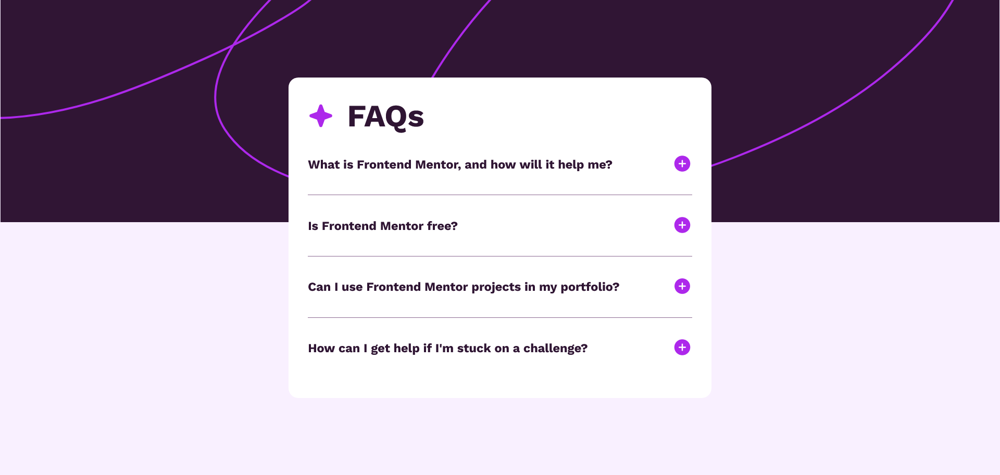

# Frontend Mentor - FAQ accordion solution

This is a solution to the [FAQ accordion challenge on Frontend Mentor](https://www.frontendmentor.io/challenges/faq-accordion-wyfFdeBwBz).

## Table of contents

- [Overview](#overview)
  - [The challenge](#the-challenge)
  - [Screenshot](#screenshot)
  - [Links](#links)
- [My process](#my-process)
  - [Built with](#built-with)
  - [What I learned](#what-i-learned)
- [Author](#author)

## Overview

### The challenge

Users should be able to:

- Hide/Show the answer to a question when the question is clicked
- Navigate the questions and hide/show answers using keyboard navigation alone
- View the optimal layout for the interface depending on their device's screen size
- See hover and focus states for all interactive elements on the page

### Screenshot



### Links

- Solution URL: [Faq-main](https://dawidtt.github.io/Faq-main/)

## My process

### Built with

- Semantic HTML5 markup
- CSS custom properties
- Basic JavaScript
- Flexbox
- Mobile-first workflow

### What I learned

This project is the first one when I used JavaScript to make my website interactive

```js
let arrTrue = [true, true, true, true];
let arrFalse = [false, false, false, false];
let arrRemainder = [true, true, true];
function toggleText(n) {
  const visible = document.getElementsByClassName("hidden");
  const buttonImg = document.getElementsByClassName("button-img");
  visible[n].classList.toggle("visible");
  arrRemainder[n] = arrTrue[n];
  arrTrue[n] = arrFalse[n];
  arrFalse[n] = arrRemainder[n];

  if (arrTrue[n] == true) {
    buttonImg[n].src = "./assets/images/icon-plus.svg";
  } else {
    buttonImg[n].src = "./assets/images/icon-minus.svg";
  }
}
```

## Author

- GitHub - [Dawitt](https://github.com/dawidtt)
